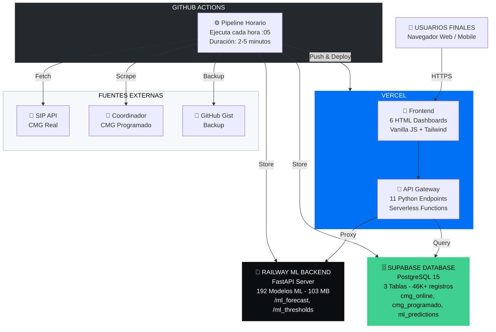
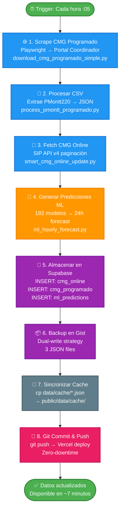
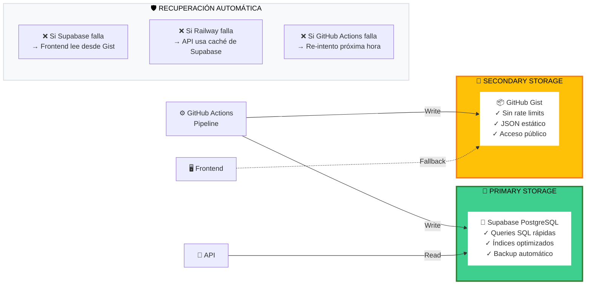

# Arquitectura de la Plataforma - Sistema de Predicción CMG

**Sistema Pudidi - Predicción de Precios de Energía**
**Documento preparado para:** Cliente
**Fecha:** 21 de Noviembre, 2025

---

## 1. ARQUITECTURA GENERAL

Sistema distribuido con **4 componentes principales**:

| Componente | Tecnología | Función |
|------------|-----------|---------|
| **Frontend + API** | Vercel | 6 Dashboards interactivos + 11 API endpoints |
| **ML Backend** | Railway | Inferencia con 192 modelos ML (103 MB) |
| **Base de Datos** | Supabase | PostgreSQL con 46K+ registros históricos |
| **Automatización** | GitHub Actions | Pipeline de datos horario (ejecuta cada hora :05) |

**URL Producción:** https://pudidicmgprediction.vercel.app

---

## 2. DIAGRAMA DE ARQUITECTURA



---

## 3. FLUJO DE DATOS - PIPELINE HORARIO

**Trigger:** Cada hora a los :05 minutos (ej: 10:05, 11:05, 12:05...)
**Duración:** 2-5 minutos por ejecución
**Workflow:** `.github/workflows/cmg_online_hourly.yml`



---

## 4. COMPONENTES DETALLADOS

### A) Frontend - 6 Dashboards

| Dashboard | Archivo | Función |
|-----------|---------|---------|
| Principal | `index.html` | Precios en tiempo real, gráficos 24h |
| ML Config | `ml_config.html` | Configuración y predicciones ML |
| Optimizador | `optimizer.html` | Optimización hidro con Linear Programming |
| Rendimiento | `rendimiento.html` | Análisis de performance de pronósticos |
| Comparación | `forecast_comparison.html` | Comparación detallada ML vs Coordinador |
| Heatmap | `performance_heatmap.html` | Mapa de calor de accuracy por horizonte |

**Stack:** HTML5 + Vanilla JavaScript + Tailwind CSS + Chart.js

### B) API Gateway - 11 Endpoints

**Datos Core:**
- `GET /api/index.py` - Datos principales del dashboard
- `GET /api/cmg/current.py` - CMG histórico

**ML Predictions:**
- `GET /api/ml_forecast.py` - Predicciones 24h desde Supabase
- `GET /api/ml_thresholds.py` - Umbrales de decisión (proxy a Railway)

**Optimización:**
- `POST /api/optimizer.py` - Optimización lineal de generación

**Performance:**
- `POST /api/performance.py` - Comparar pronósticos vs reales
- `GET /api/performance_heatmap.py` - Heatmap de accuracy
- `GET /api/performance_range.py` - Análisis por rango de fechas
- `GET /api/historical_comparison.py` - Comparación histórica detallada

**Utilidades:**
- `GET /api/cache.py` - Archivos en caché
- `GET /api/debug/supabase.py` - Debug de conexión

### C) ML Backend - Railway

**¿Por qué Railway?**
- Modelos ML pesan **103 MB** → No caben en Vercel (límite 250 MB por función)
- Railway permite containers sin límite de tamaño
- Sin cold starts (container siempre activo)

**Tecnología:**
- FastAPI (Python 3.11)
- 192 modelos pre-entrenados (96 zero detection + 96 value prediction)
- Dockerfile con Python 3.11-slim

**Endpoints:**
- `GET /api/ml_forecast` → Genera predicciones para 24 horas
- `GET /api/ml_thresholds` → Retorna umbrales calibrados
- `GET /health` → Health check

### D) Base de Datos - Supabase

**3 Tablas Principales:**

| Tabla | Registros | Actualización | Función |
|-------|-----------|---------------|---------|
| `cmg_online` | ~1,500 | Cada hora | Precios reales (últimas 48h) |
| `cmg_programado` | 44,573 | Cada hora | Pronósticos Coordinador (Oct 20 - Nov 18) |
| `ml_predictions` | ~1,000 | Cada hora | Predicciones ML (últimos 2 días) |

**Esquema `cmg_programado`:**
```sql
forecast_datetime TIMESTAMPTZ  -- Cuándo se generó el pronóstico
target_datetime TIMESTAMPTZ    -- Qué hora se está prediciendo
horizon INT                    -- Distancia temporal (1-24)
node VARCHAR                   -- Nodo eléctrico (PMontt220)
cmg_usd DECIMAL                -- Precio en USD/MWh
```

### E) Automatización - GitHub Actions

**Workflows Activos:**
1. `cmg_online_hourly.yml` - Pipeline principal (cada hora :05)
2. `daily_optimization.yml` - Optimización diaria (17:00 Chilean time) [Opcional]
3. `cmg_5pm_snapshot.yml` - Snapshot diario [Opcional]

**Ventajas:**
- Gratis (2000 minutos/mes en free tier)
- Logs accesibles 90 días
- Re-intento automático si falla

---

## 5. RESILIENCIA - ESTRATEGIA DUAL-WRITE

Cada dato se escribe simultáneamente en **2 lugares** para garantizar alta disponibilidad:



---

## 6. STACK TECNOLÓGICO

### Backend
- Python 3.11 (API + ML + Scripts)
- FastAPI (Railway ML backend)
- LightGBM + XGBoost (192 modelos ML)
- PuLP (Linear programming optimizer)
- Playwright (Web scraping)

### Frontend
- HTML5 + Vanilla JavaScript (ES6+)
- Tailwind CSS 3.x
- Chart.js 4.x

### Database
- PostgreSQL 15 (via Supabase)
- PostgREST (Auto-generated REST API)

### DevOps
- Git + GitHub (Version control)
- GitHub Actions (CI/CD)
- Docker (Railway containerization)

---

## 7. CARACTERÍSTICAS TÉCNICAS CLAVE

### Latencia
- Frontend load: <1 segundo (CDN)
- API response: <500ms promedio
- ML inference: <2 segundos para 24 predicciones

### Confiabilidad
- Uptime: 99%+ (GitHub Actions)
- Dual-write strategy (redundancia)
- Auto-recovery ante fallas

### Seguridad
- HTTPS en todos los endpoints
- Environment variables para credenciales
- CORS configurado
- RLS (Row Level Security) en Supabase

### Actualización
- Pipeline horario automático
- Zero-downtime deployments (Vercel)
- Cache invalidation automático

---

**Documento preparado por:** TM3 Corp para Pudidi
**Contacto técnico:** Ver repositorio GitHub
**URL Repositorio:** https://github.com/TM3-Corp/pudidi_cmg_prediction
